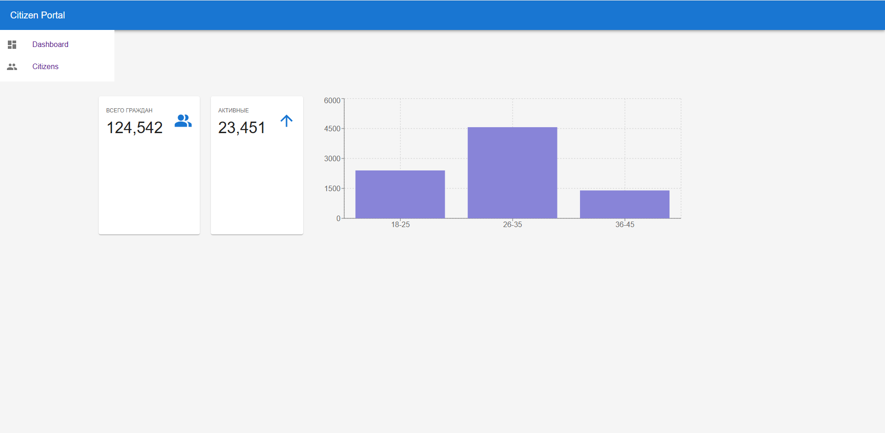
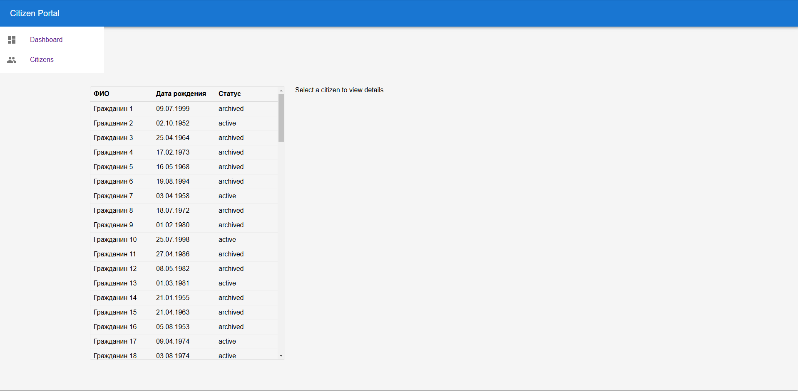
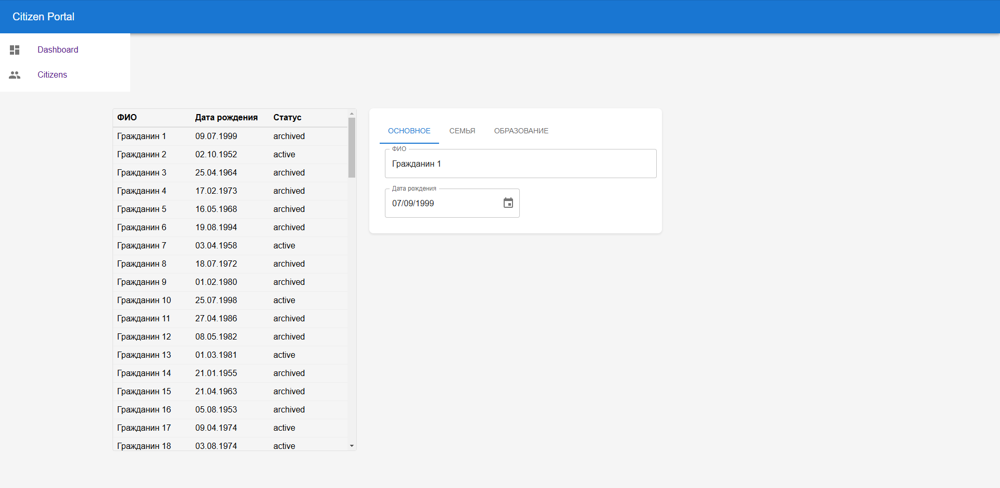

# Тестовое задание для Frontend-разработчика НПЦ ИРС
## Запуск проекта
1) Склонировать проект на локальное устройство командой
```
git clone https://github.com/AlphaRasch/citizen-managment-dashboard.git
```
2) Перейти в директорию проекта
```
cd citizen-managment-dashboard
```
3) Установить зависимости
```
npm i
```
4) Запустить проект (сборщик Vite)
```
npm run dev
```
## Запуск проекта Docker
1) Склонировать проект на локальное устройство командой
```
git clone https://github.com/AlphaRasch/citizen-managment-dashboard.git
```
2) Перейти в директорию проекта
```
cd citizen-managment-dashboard
```
3) Собрать docker image
```
docker build -t citizen-project .
```
4) Запустить docker container
```
docker run -p 5173:5173 citizen-project
```
## Итоговое приложение
Перейти по адресу <http://localhost:5173>  
Домашняя страница <http://localhost:5173/> 
  
Таблица с гражданами <http://localhost:5173/citizens>


